# Execution Plan - 테이블오더 서비스

## Detailed Analysis Summary

### Change Impact Assessment
- **User-facing changes**: Yes - 고객 주문 UI 및 관리자 대시보드 전체 신규 구축
- **Structural changes**: Yes - 전체 시스템 아키텍처 신규 설계 (Spring Boot + 바닐라 JS + PostgreSQL)
- **Data model changes**: Yes - 9개 핵심 엔티티 신규 설계 (Store, Admin, Table, TableSession, Category, Menu, Order, OrderItem, OrderHistory)
- **API changes**: Yes - 고객용 5개 + 관리자용 13개 API 엔드포인트 신규 설계
- **NFR impact**: Yes - 보안(JWT, RBAC, SECURITY-01~15), 성능(SSE, 응답시간), 확장성(다중 매장)

### Risk Assessment
- **Risk Level**: Medium
- **Rollback Complexity**: Easy (Greenfield - 롤백 불필요)
- **Testing Complexity**: Moderate (다중 사용자 유형, 실시간 통신, 세션 관리)

---

## Workflow Visualization

```mermaid
flowchart TD
    Start(["User Request"])
    
    subgraph INCEPTION["🔵 INCEPTION PHASE"]
        WD["Workspace Detection<br/><b>COMPLETED</b>"]
        RA["Requirements Analysis<br/><b>COMPLETED</b>"]
        US["User Stories<br/><b>COMPLETED</b>"]
        WP["Workflow Planning<br/><b>IN PROGRESS</b>"]
        AD["Application Design<br/><b>EXECUTE</b>"]
        UG["Units Generation<br/><b>EXECUTE</b>"]
    end
    
    subgraph CONSTRUCTION["🟢 CONSTRUCTION PHASE"]
        FD["Functional Design<br/><b>EXECUTE</b>"]
        NFRA["NFR Requirements<br/><b>EXECUTE</b>"]
        NFRD["NFR Design<br/><b>EXECUTE</b>"]
        CG["Code Generation<br/><b>EXECUTE</b>"]
        BT["Build and Test<br/><b>EXECUTE</b>"]
    end
    
    Start --> WD
    WD --> RA
    RA --> US
    US --> WP
    WP --> AD
    AD --> UG
    UG --> FD
    FD --> NFRA
    NFRA --> NFRD
    NFRD --> CG
    CG --> BT
    BT --> End(["Complete"])
    
    style WD fill:#4CAF50,stroke:#1B5E20,stroke-width:3px,color:#fff
    style RA fill:#4CAF50,stroke:#1B5E20,stroke-width:3px,color:#fff
    style US fill:#4CAF50,stroke:#1B5E20,stroke-width:3px,color:#fff
    style WP fill:#4CAF50,stroke:#1B5E20,stroke-width:3px,color:#fff
    style AD fill:#FFA726,stroke:#E65100,stroke-width:3px,stroke-dasharray: 5 5,color:#000
    style UG fill:#FFA726,stroke:#E65100,stroke-width:3px,stroke-dasharray: 5 5,color:#000
    style FD fill:#FFA726,stroke:#E65100,stroke-width:3px,stroke-dasharray: 5 5,color:#000
    style NFRA fill:#FFA726,stroke:#E65100,stroke-width:3px,stroke-dasharray: 5 5,color:#000
    style NFRD fill:#FFA726,stroke:#E65100,stroke-width:3px,stroke-dasharray: 5 5,color:#000
    style CG fill:#4CAF50,stroke:#1B5E20,stroke-width:3px,color:#fff
    style BT fill:#4CAF50,stroke:#1B5E20,stroke-width:3px,color:#fff
    style INCEPTION fill:#BBDEFB,stroke:#1565C0,stroke-width:3px,color:#000
    style CONSTRUCTION fill:#C8E6C9,stroke:#2E7D32,stroke-width:3px,color:#000
    style Start fill:#CE93D8,stroke:#6A1B9A,stroke-width:3px,color:#000
    style End fill:#CE93D8,stroke:#6A1B9A,stroke-width:3px,color:#000
    
    linkStyle default stroke:#333,stroke-width:2px
```



### Text Alternative
```
Phase 1: INCEPTION
  - Workspace Detection (COMPLETED)
  - Requirements Analysis (COMPLETED)
  - User Stories (COMPLETED)
  - Workflow Planning (IN PROGRESS)
  - Application Design (EXECUTE)
  - Units Generation (EXECUTE)

Phase 2: CONSTRUCTION
  - Functional Design (EXECUTE, per-unit)
  - NFR Requirements (EXECUTE, per-unit)
  - NFR Design (EXECUTE, per-unit)
  - Code Generation (EXECUTE, per-unit)
  - Build and Test (EXECUTE)
```

---

## Phases to Execute

### 🔵 INCEPTION PHASE
- [x] Workspace Detection (COMPLETED)
- [x] Requirements Analysis (COMPLETED)
- [x] User Stories (COMPLETED)
- [x] Workflow Planning (IN PROGRESS)
- [ ] Application Design - **EXECUTE**
  - **Rationale**: 신규 프로젝트로 컴포넌트 식별, 서비스 레이어 설계, 컴포넌트 간 의존성 정의가 필요
- [ ] Units Generation - **EXECUTE**
  - **Rationale**: 백엔드(Spring Boot) + 프론트엔드(고객 UI, 관리자 UI) 등 다중 모듈로 분해 필요

### 🟢 CONSTRUCTION PHASE (Per-Unit)
- [ ] Functional Design - **EXECUTE**
  - **Rationale**: 9개 핵심 엔티티, 복잡한 세션 관리, 주문 상태 전이 등 상세 비즈니스 로직 설계 필요
- [ ] NFR Requirements - **EXECUTE**
  - **Rationale**: 보안(SECURITY-01~15 전체 적용), 성능(SSE 2초 이내), JWT 인증, RBAC 등 NFR 요구사항 존재
- [ ] NFR Design - **EXECUTE**
  - **Rationale**: NFR Requirements에서 도출된 패턴을 설계에 반영 필요
- [ ] Infrastructure Design - **SKIP**
  - **Rationale**: 현재 단계에서는 클라우드 배포 환경만 결정되었고, 구체적인 인프라 설계는 추후 진행. 코드 생성에 집중.
- [ ] Code Generation - **EXECUTE** (ALWAYS)
  - **Rationale**: 실제 코드 구현 필수
- [ ] Build and Test - **EXECUTE** (ALWAYS)
  - **Rationale**: 빌드 및 테스트 검증 필수

### 🟡 OPERATIONS PHASE
- [ ] Operations - **PLACEHOLDER**
  - **Rationale**: 향후 배포 및 모니터링 워크플로우 확장 예정

---

## Skipped Stages Summary

| Stage | Rationale |
|-------|-----------|
| Reverse Engineering | Greenfield 프로젝트 - 기존 코드 없음 |
| Infrastructure Design | 구체적 인프라 설계는 추후 진행, 현재는 코드 구현에 집중 |

---

## Success Criteria
- **Primary Goal**: 테이블오더 MVP 서비스 구현 (고객 주문 + 관리자 운영)
- **Key Deliverables**:
  - Spring Boot 백엔드 (REST API + SSE)
  - 바닐라 JS 프론트엔드 (고객 UI + 관리자 UI)
  - PostgreSQL 데이터 모델
  - 단위 테스트
  - 빌드 및 테스트 가이드
- **Quality Gates**:
  - 모든 API 엔드포인트 구현 및 테스트
  - SECURITY-01~15 보안 규칙 준수
  - INVEST 기준 충족하는 사용자 스토리 구현
  - 단위 테스트 커버리지
